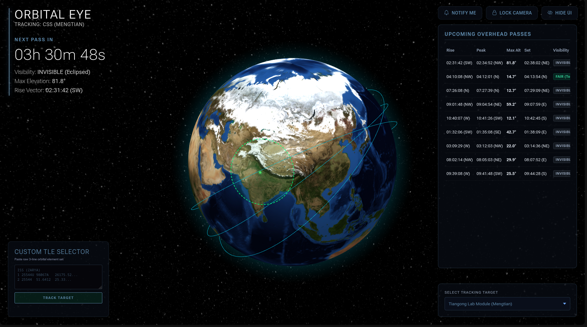

# Orbital Eye

Orbital Eye is a web-based real-time almost fully accurate Satellite Tracker which features international stations and satellites and displays them on an orbit on top of a 3d rendered WebGL Globe. This program is mainly catered towards astrophotographers like myself!

---

## Preview



---

## Inspiration

Orbital Eye started as a small Python script that told me when the International Space Station would pass overhead so I could try photographing it.

As someone interested in astronomy and astrophotography, I quickly realized that capturing satellites isn't just about owning a camera. You need to know when the satellite will appear, where it will rise, whether it will still be illuminated by sunlight, and whether the weather will allow you to see it at all.

What began as a simple ISS pass predictor slowly evolved into a complete satellite tracking platform. Along the way, I learned about orbital mechanics, coordinate systems, astronomical calculations, weather forecasting, and 3D visualization.

Today, Orbital Eye combines all of those pieces into a single application.

---

## Features

### 🛰️ Satellite Pass Prediction

Calculate upcoming passes for your exact location using real TLE orbital data.

For every pass, Orbital Eye provides:

* Rise time
* Peak time
* Set time
* Maximum elevation
* Direction of travel
* Local timezone conversion

---

### 🌤️ Visibility Forecasting

A satellite passing overhead does not necessarily mean it will be visible.

Orbital Eye combines:

* Cloud cover forecasts
* Satellite illumination status
* Solar position
* Elevation angle

to estimate real-world viewing conditions.

Passes are automatically rated:

* EXCELLENT
* GOOD
* FAIR
* POOR
* INVISIBLE

---

### 📡 Live Telemetry

During active passes, Orbital Eye continuously updates:

* Altitude angle
* Azimuth angle
* Cardinal direction
* Visibility status

allowing observers to track satellites in real time.

---

### 🌍 Interactive 3D Globe

Visualize satellites directly on a rotatable 3D Earth.

Features include:

* Live satellite position tracking
* Future orbit path rendering
* Observer location display
* Smooth orbit animation
* Ground station field-of-view visualization

---

### 🎯 Ground Station Field of View

Orbital Eye projects the observer's approximate visible horizon directly onto the globe.

The field-of-view ring represents the region where satellites can realistically be observed from the selected location, making it much easier to understand when an orbit enters or exits viewing range.

---

### 🚀 Custom TLE Injection

Not seeing the satellite you want?

Paste any valid TLE directly into Orbital Eye and instantly:

* Generate orbit predictions
* Calculate upcoming passes
* Render orbit paths
* Begin live tracking

No page refresh required.

---

### 🛰️ Multiple Spacecraft Support

Track a wide variety of objects including:

* International Space Station (ISS)
* Tiangong Space Station
* Crew Dragon spacecraft
* Soyuz spacecraft
* Cargo vehicles
* Cubesats
* Experimental satellites
* Orbital debris

Any object available through the loaded TLE dataset can be tracked.

---

## How It Works

### 1. Orbital Data Acquisition

Orbital Eye downloads Two-Line Element (TLE) data from CelesTrak and converts those elements into mathematical satellite models using Skyfield.

### 2. Pass Computation

The application calculates rise, peak, and set events for the observer's location over the next 48 hours.

### 3. Visibility Analysis

Each pass is evaluated using:

* Weather forecasts
* Solar geometry
* Satellite illumination
* Elevation thresholds

to determine whether the object is likely to be visible.

### 4. Orbit Propagation

Future satellite positions are propagated in advance and converted into geographic coordinates.

These coordinates are used to render orbit paths and animate satellites on the 3D globe.

### 5. Live Tracking

During active passes, Orbital Eye continuously calculates the satellite's position relative to the observer and streams telemetry updates to the frontend.

---

## Technical Highlights

### Offline TLE Caching

Satellite tracking depends on external orbital datasets.

To prevent outages from breaking the application, Orbital Eye automatically caches downloaded TLE files locally and falls back to cached data whenever necessary.

### Visibility Classification Engine

Rather than simply displaying pass times, Orbital Eye attempts to answer a more useful question:

> Will I actually be able to see it?

This required combining weather forecasts, orbital calculations, solar geometry, and observer position into a single visibility model.

### Efficient Orbit Animation

Instead of requesting satellite positions continuously, Orbital Eye precomputes future orbital coordinates and sends them to the browser.

The frontend interpolates between those positions locally, significantly reducing server load while maintaining smooth animation.

---

## Tech Stack

### Backend

* Python
* Flask
* Skyfield
* Requests

### Frontend

* HTML
* CSS
* JavaScript

### Visualization

* Globe.gl
* Three.js

### Data Sources

* CelesTrak TLE Data
* Open-Meteo Weather API
* JPL DE421 Ephemeris

---

## Project Structure

```text
orbital-eye/
│
├── app.py
├── predictor.py
├── requirements.txt
│
├── templates/
│   └── index.html
│
├── static/
│   ├── script.js
│   └── style.css
│
├── screenshots/
│   └── dashboard.png
│
└── stations.txt
```

---

## Running Locally

Clone the repository:

```bash
git clone https://github.com/avishgoyal/orbital-eye.git
cd orbital-eye
```

Install dependencies:

```bash
pip install -r requirements.txt
```

Run the server:

```bash
python app.py
```

Open:

```text
http://127.0.0.1:5000
```

---

## Challenges

Some of the most difficult parts of the project included:

* Handling unreliable external orbital datasets
* Building a fallback caching system
* Determining actual visibility instead of just pass times
* Combining weather forecasts with astronomical calculations
* Creating smooth orbit animations on a 3D globe
* Correctly handling orbital wrap-around at the International Date Line

---

## What I Learned

Through this project I learned about:

* Orbital mechanics
* Satellite tracking
* Geospatial mathematics
* Coordinate transformations
* Astronomical visibility prediction
* API integration
* Flask development
* Interactive 3D visualization

Most importantly, I learned how much engineering and mathematics goes into the tools we often take for granted.

---

## Future Improvements

* Satellite search by NORAD ID
* Brightness prediction
* Pass notifications
* Mobile optimization
* Historical orbit playback
* Augmented reality sky guidance
* Additional orbital datasets

---

## Credits

* Orbital data provided by CelesTrak
* Weather forecasts provided by Open-Meteo
* Orbital calculations powered by Skyfield
* 3D visualization powered by Globe.gl and Three.js

---

## License

MIT License

---

Built by **Avish Goyal** 🚀

*Because staring at moving dots in space is cooler than it sounds.*
