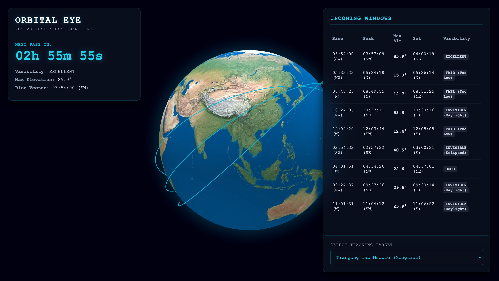

# 🛰️ Orbital Eye

A real-time satellite tracking platform that predicts overhead passes, evaluates viewing conditions, streams live telemetry, and visualizes spacecraft on an interactive 3D globe.

Built because I wanted to know exactly when to point my camera at the sky.

---

## Preview

```md

```

---

## Inspiration

Orbital Eye started as a simple Python script that told me when the International Space Station would pass overhead so I could try photographing it.

I've always been interested in astronomy and astrophotography, and one thing I quickly realized is that capturing satellites isn't just about having a camera. You need to know exactly when the satellite will appear, where it will come from, whether it will be illuminated by sunlight, and whether the weather will allow you to see it at all.

I initially built a small command-line ISS pass predictor for myself. As I learned more about orbital mechanics and satellite tracking, the project grew far beyond its original scope.

Today, Orbital Eye can track multiple spacecraft, estimate visibility using weather forecasts and sunlight calculations, stream live telemetry during active passes, and visualize orbital motion on an interactive 3D globe.

While Delhi's light pollution doesn't always make satellite photography easy, the project has become an invaluable tool whenever I travel to darker skies.

---

## What It Does

### 🛰️ Satellite Pass Prediction

Orbital Eye calculates upcoming satellite passes for your exact location using real orbital element data.

For each pass it provides:

* Rise time
* Peak time
* Set time
* Direction of travel
* Maximum elevation angle

The application automatically converts all times to the user's local timezone.

---

### 🌤️ Visibility Forecasting

A satellite passing overhead does not necessarily mean it will be visible.

Orbital Eye combines:

* Forecast cloud cover
* Satellite illumination status
* Solar position
* Elevation angle

to estimate viewing quality.

Passes are automatically rated as:

* EXCELLENT
* GOOD
* FAIR
* POOR
* INVISIBLE

---

### 📡 Live Telemetry

When a pass begins, Orbital Eye switches into live tracking mode and continuously updates:

* Altitude angle
* Azimuth angle
* Cardinal direction
* Horizon visibility status

This allows observers to follow a satellite's movement across the sky in real time.

---

### 🌍 Interactive 3D Globe

Orbital Eye includes a fully interactive globe that visualizes:

* Future orbital paths
* Current satellite position
* Observer location
* Orbit propagation data

Instead of reading raw coordinates, users can see exactly how a spacecraft moves around Earth.

---

### 🚀 Multiple Spacecraft Support

The application is not limited to the ISS.

Supported objects include:

* International Space Station (ISS)
* Tiangong Space Station modules
* Crew Dragon spacecraft
* Soyuz spacecraft
* Cargo vehicles
* Cubesats
* Experimental satellites
* Tracked orbital debris

Any object available within the downloaded TLE dataset can be tracked.

---

## How It Works

### 1. Orbital Data Acquisition

Orbital Eye retrieves Two-Line Element (TLE) data from CelesTrak.

These orbital elements are converted into mathematical satellite models using Skyfield.

---

### 2. Pass Computation

For a given observer location, the system calculates:

* Rise events
* Peak events
* Set events

over the next 48 hours.

---

### 3. Visibility Analysis

Each pass is analyzed using:

* Weather forecasts from Open-Meteo
* Solar geometry calculations
* Satellite sunlight exposure
* Elevation thresholds

to determine whether the spacecraft is likely to be visible.

---

### 4. Orbit Propagation

Future satellite positions are propagated and converted into geographic coordinates.

These coordinates are then rendered on the 3D globe.

---

### 5. Live Tracking

During active passes, Orbital Eye continuously calculates the satellite's position relative to the observer and streams telemetry updates to the frontend.

---

## Technical Highlights

Some of the features I found most interesting to build:

### Automatic Geolocation

The application requests the user's location through the browser and automatically updates all calculations.

---

### Offline TLE Caching

Satellite tracking depends on external orbital data.

To avoid failures when CelesTrak is unavailable, Orbital Eye automatically caches downloaded TLE files locally and falls back to cached data whenever necessary.

---

### Visibility Classification Engine

Instead of simply showing pass times, the application attempts to answer a more useful question:

> "Will I actually be able to see it?"

This required combining orbital calculations, weather forecasts, solar geometry, and observer position into a single visibility model.

---

### Smooth Orbit Animation

Future orbital positions are propagated in advance and interpolated on the frontend to create continuous satellite motion around the globe.

---

## Tech Stack

### Backend

* Python
* Flask
* Skyfield
* Requests

### Frontend

* HTML
* CSS
* JavaScript

### Visualization

* Globe.gl
* Three.js

### External Data Sources

* CelesTrak TLE Data
* Open-Meteo Weather API
* JPL DE421 Ephemeris

---

## Project Structure

```text
orbital-eye/
│
├── app.py
├── predictor.py
├── requirements.txt
│
├── templates/
│   └── index.html
│
├── static/
│   ├── script.js
│   └── style.css
│
└── stations.txt
```

---

## Running Locally

Clone the repository:

```bash
git clone https://github.com/avishgoyal/orbital-eye.git
cd orbital-eye
```

Install dependencies:

```bash
pip install -r requirements.txt
```

Run the Flask server:

```bash
python app.py
```

Open:

```text
http://127.0.0.1:5000
```

---

## Challenges

One of the biggest challenges was reliability.

Satellite tracking relies heavily on external orbital datasets, and those services occasionally experience downtime. Building a fallback caching system was necessary to ensure the application remained usable even when data providers were unavailable.

Another challenge was determining actual visibility. A satellite can pass directly overhead and still be impossible to see due to daylight, weather conditions, or Earth's shadow. Combining all of those factors into a single prediction system required much more work than simply calculating orbital positions.

The 3D visualization was also significantly more complex than expected, especially when trying to create smooth orbital animation instead of plotting static coordinates.

---

## What I Learned

Through this project I learned about:

* Orbital mechanics
* Satellite tracking
* Coordinate systems
* Geospatial calculations
* Astronomical visibility prediction
* API integration
* Frontend-backend communication
* Flask application development
* Interactive 3D visualization

Most importantly, I learned how much engineering and mathematics goes into the tools we often take for granted.

---

## Future Improvements

Some features I would like to add in future versions:

* Satellite search by NORAD ID
* Starlink tracking
* Brightness prediction
* Pass notifications
* Mobile-optimized interface
* Augmented reality sky guidance
* Historical orbit playback
* Additional orbital datasets

---

## Credits

* Orbital data provided by CelesTrak
* Weather forecasts provided by Open-Meteo
* Orbital calculations powered by Skyfield
* 3D visualization powered by Globe.gl and Three.js

---

## License

MIT License

---

Built because I wanted to know when to point my camera at the sky.
